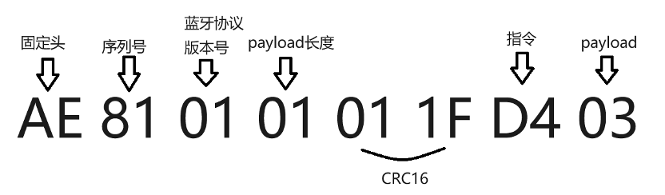
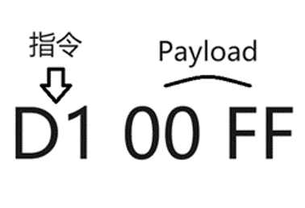
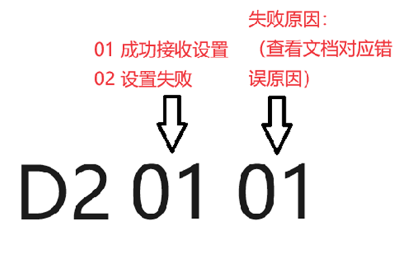
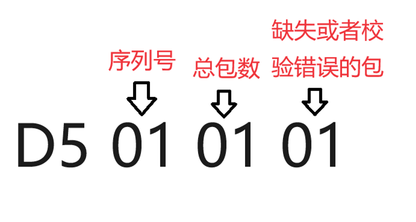
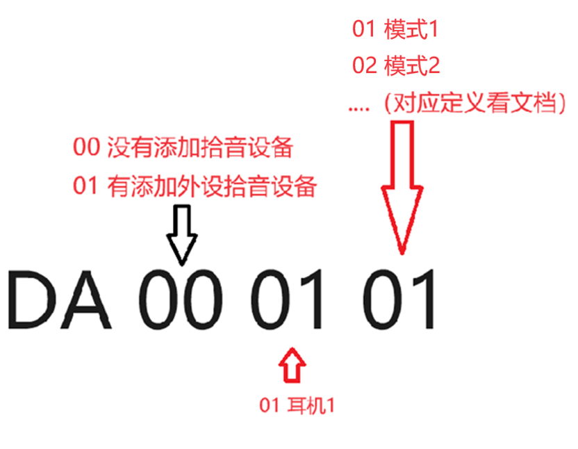
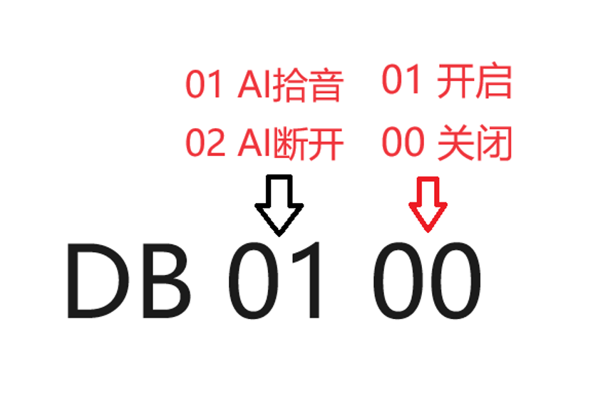
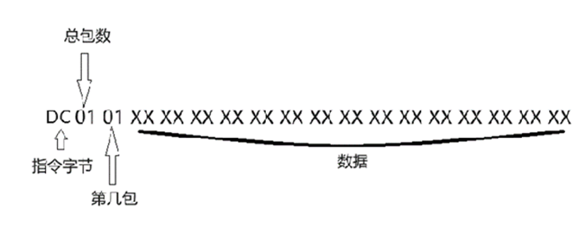
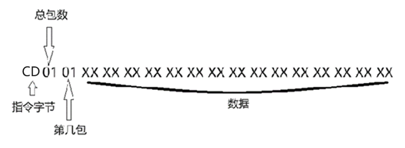
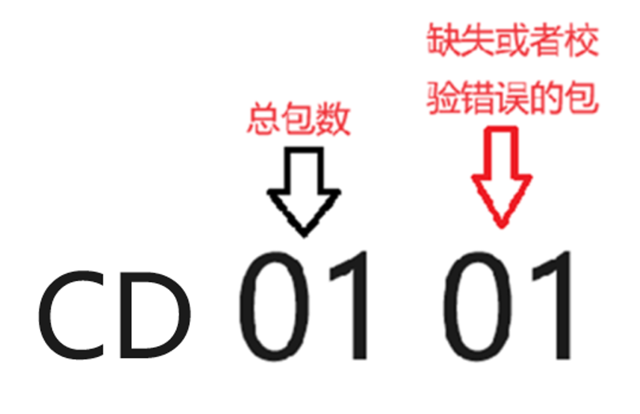
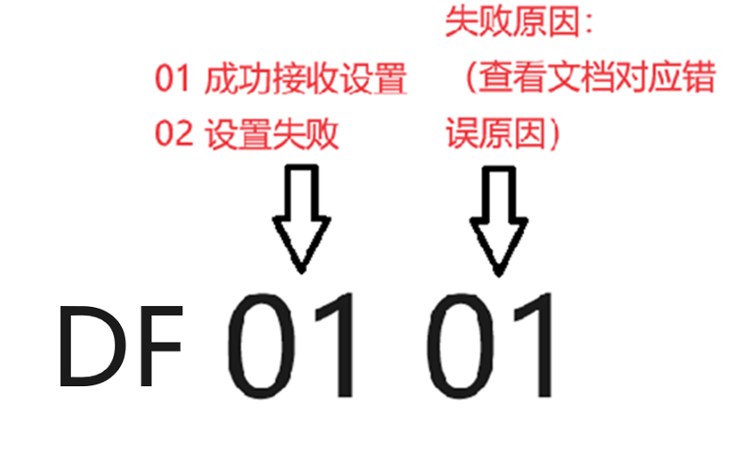

# Bluetooth communication protocol V1.14

Overview:

1.     Stack endianness:

In the content covered in this document, all endian-related aspects are in big‐end. For example, if a uint16_ta = 0xABCD, then the transmission time is A, B, C, D in the order of the byte stream from low to high.

Similarly, if a byte (1 byte) in a byte stream contains two values a=0xa and b=0xb, each of which occupies 4 bits, the throttling status is a, and the high position is b. Then the content of this one byte in the byte stream should be (binary representation): 1010 1011.

**Fixed head + serial number + version + package length + CRC16 + instructions + data**

| **1 byte** | **AE**                                   | **Fixed head**         |
| ---------- | ---------------------------------------- | --------------- |
| **1 byte** | **Each new message increments by 1, starting from 1 after the maximum value (if it is the same message, but the data is too long to pack)** | **Serial number**         |
| **1 byte** | **The version of the Bluetooth protocol, the first version used 0x01**                   | **Version number**         |
| **1 byte** | **Up to 170**                                | **The length of the valid payload** |
| **2 byte** |                                          | **CRC16**       |
| **1 byte** | **Custom directives**                                | **directives**          |
| **…**      | **The maximum usage is 170 bytes**                         | **Payload**     |


**Downlink Command:**



**All text transmissions are encoded using UTF-8**


**Instruction bytes:**

- D1: Set the screen off time

- D2: Adjust the volume

- D3: Brightness of glasses

- D4: Set the language

- D5: Message notification

- D6: Navigation

- D7: Set the time

- D9: Get device information

- DD: Message notification settings

- DE: Sensor data acquisition

- DA: AI mode

- DB: Controls the state of the glasses

- DC: AI questions are transmitted to text

- CD: AI Answer Text Transmission

- DF: Change the Bluetooth name of the device


**CRC16 calculation method // Direct calculation method calculates CRC x16+x12+x5+1**

```cpp
uint16_t crc_IBM(uint8_t *ptr, int len)
{

    unsigned int i;

    unsigned short crc = 0x0000; //Initial value of the CRC-16 bit register 

    while(len‐‐)
    {
        crc ^= *ptr++;

        for (i = 0; i < 8; ++i)
        {
            if (crc & 1)
                crc = (crc >> 1) ^ 0xA001;
            else
                crc = (crc >> 1);
        }
    }

    return crc;
}
```


Java version：

```java
public static int CRC16_IBM(byte[] buffer)
{

    int wCRCin = 0x0000;

    int wCPoly = 0xa001;

    int bitMax = 8;

    for (byte b : buffer) {

        wCRCin ^= ((int) b & 0x00ff);

        for (int j = 0; j < bitMax; j++) {

            if ((wCRCin & 0x0001) != 0) {

                wCRCin >>= 1;

                wCRCin ^= wCPoly;

            } else {

                wCRCin >>= 1;

            }

        }

    }

    return wCRCin ^= 0x0000;

}
```


**Subsequent examples are all directives + payload**

**1.**     **1.	Set the screen-off time D1**

| 2 byte | 0x0001-0xffff | Unit: seconds |
| ------ | ------------- | ---- |

The mobile phone sends instructions to the glasses:



The glasses side replies to the mobile phone: (the cause of the error is collected and the document is supplemented during the development process).


**2.**     **Adjust the volume D2**

| 1 byte | 0x00-0x0f | 0-15级 |
| ------ | --------- | ----- |

The mobile phone sends instructions to the glasses:


The glasses side replies to the mobile phone: (the cause of the error is collected and the document is supplemented during the development process).



**3.**     **Adjust the brightness D3**

| 1 byte | 0x01-0x20 | Brightness level |
| ------ | --------- | ---- |

The mobile phone sends instructions to the glasses:


The glasses side replies to the mobile phone: (the cause of the error is collected and the document is supplemented during the development process).


**4.**     **Toggle language D4**

| 1 byte | 0x01-0x07 | 0x01 English <br/>0x02 German <br/>0x03 Japanese <br/>0x04 Chinese<br/> 0x05 French <br/>0x06 Korean <br/>0x07 Spanish |
| ------ | --------- | --------------------------------------------------------------------------------------- |

The mobile phone sends instructions to the glasses:


The glasses side replies to the mobile phone: (the cause of the error is collected and the document is supplemented during the development process).


**5.**     **Message notification D5**

The data is split and assembled in UTF-8 as a key-value

**B:**

- 0 call alerts

- 1 SMS Alerts

- 2 Skype Reminders

- 3 Line reminders

- 4 kakaotalk reminders

- 5 facebook reminders

- 6 twitter（X）reminders

- 7 whatsapp reminders

- 8 linkedin reminders

- 9 viber reminders

- 10 instagram reminders

- 11 messenger reminders

- 12 WeChat reminders

- 13 QQ reminders

- 14 DingTalk reminder

- 15 Other APP

**U:**

- 0 default box

- 1 Style one  

- 2 Style two 

- 3 Style three 

The specific format of Key-Value is as follows:

**t:title; c:content; b:Which software it belongs to; m: year, month, day, hour, minute, second (2404071630) represents 16:30 on April 7, 2024;u:0**

The mobile phone sends instructions to the glasses:


The glasses reply to the mobile phone (if there is a missing or checksum error packet when the packet data is summarized, you need to re-request the corresponding packet).



**6.**     **NavigateD6**

**Icon Navigation Direction:**

    **0x00                        0x01**

     **0x02                        0x03**

     **0x04                        0x05**

     **0x06                         0x07**

     **0x08                         0x09**

     **0x0A                         0x0B**

     **0x0C                         0x0D**

     **0x0E                         0x0F**

     **0x10                         0x11**

     **0x12                         0x13**

     **0x14                         0x15**

     **0x16                          0x17**

     **0x18                         0x19**

     **0x1A                         0x1B**

     **0x1C                         0x1D**

     **0x1E                            0x1F**

     **0x20                            0x21**

     **0x22                            0x23**

     **0x24                            0x25**

     **0x26                            0x27**

      **0x28                           0x29**

     **0x2A                            0x2B**

     **0x2C                            0x2D**

     **0x2E                            0x2F**

     **0x30                            0x31**

     **0x32                            0x33**

     **0x34                            0x35**

     **0x36                           0x37**

     **0x38                           0x39**

     **0x3A                           0x3B**

     **0x3C                           0x3D**

     **0x3E                           0x3F**

     **0x40                           0x41**

     **0x42                           0x43**

     **0x44                          0x45**

     **0x46                           0x47**

     **0x48                           0x49**

     **0x4A                           0x4B**

     **0x4C**

| 2 byte                                                 | Compare the values in the UI design draft  | icon to navigate the direction     |
|--------------------------------------------------------| ------------- |------------------------------------|
| 2 byte                                                 |               | Total Time (min)                   |
| 4 byte                                                 |               | Total distance (m)                 |
| 4 byte                                                 |               | Distance Remaining (m)             |
| 1 byte                                                 |               | Current speed                               |
| 4 byte                                                 |               | Remaining distance of the current segment (m)                        |
| 45 byte                                                |               | Navigational information                              |
| 5 byte                                                 | 1 byte indicates the traffic status | 0 - Unknown, 1 - Smooth road, 2 - Slow road, 3 - Blocked road, 4 - Severely blocked road |
| 4 bytes indicates the length of the traffic condition  | The length of the congestion state of the traffic state segment |                                    |
| …                                                      | 1 byte indicates the traffic status | 0 - Unknown, 1 - Smooth road, 2 - Slow road, 3 - Blocked road, 4 - Severely blocked road |
| 4 bytes indicates the length of the traffic condition  | The length of the congestion state of the traffic state segment |                                    |

**7.**     **Set time  D7**

| 1byte | year  | From 2000 onwards, for example, if the value is 24, the spectacle side analysis is automatically added to 2000, and the year is 2024 |
| ----- |-------| --------------------------------------- |
| 1byte | month | 1-12                                    |
| 1byte | day   | 1-31                                    |
| 1byte | hour  | 0-23                                    |
| 1byte | minute | 0-59                                    |
| 1byte | second   | 0-59                                    |

Send the mobile phone to the glasses:


The glasses side replies to the phone:


**8.**     **Get device information D9**

| 8 byte | Project firmware name: 0 for insufficient items  | Firmware name  |
| ------ | ------------- | ---- |
| 1byte  | Firmware Platform 1         | Firmware Platform |
| 1byte  | Firmware model 1        | Firmware model |
| 3byte  | Version number, for example, 1.0.1  | Version number  |
| 1byte  | The current brightness 0x01-0x20 |      |
| 1byte  | Current language 0x01-0x07 |      |
| 1byte  | Current volume 0x00-0x0f |      |
| 1byte  | Whether or not pickup is turned on       |      |
| 1byte  | What mode is it currently in      |      |

**9.**     **Message notifies DD**

| 1<br> byte | 0   | **0x01 Set up message notifications** **0x02 Get message notifications** **Get the message notification and wait for the glasses to return to the current message notification setting switch information.** |
| ---------- | --- |--------------------------------------------------------------------------------------------------------------------------------------------------------------------------------------------------------------|
| 1 byte     | 1   | Skype Notification（00 OFF，01 ON）                                                                                                                                                                             |
| 1 byte     | 2   | Line Notification（00 OFF，01 ON）                                                                                                                                                                              |
| 1 byte     | 3   | Incoming Call Alert（00 OFF，01 ON）                                                                                                                                                                            |
| 1 byte     | 4   | SMS Notification（00 OFF，01 ON）                                                                                                                                                                               |
| 1 byte     | 5   | WeChat Notification（00 OFF，01 ON）                                                                                                                                                                            |
| 1 byte     | 6   | QQ Notification（00 OFF，01 ON）                                                                                                                                                                                |
| 1 byte     | 7   | kakaotalk Notification（00 OFF，01 ON）                                                                                                                                                                         |
| 1 byte     | 8   | facebook Notification（00 OFF，01 ON）                                                                                                                                                                          |
| 1 byte     | 9   | twitter(X) Notification（00 OFF，01 ON）                                                                                                                                                                        |
| 1 byte     | 10  | whatsapp Notification（00 OFF，01 ON）                                                                                                                                                                          |
| 1 byte     | 11  | linkedin Notification（00 OFF，01 ON）                                                                                                                                                                          |
| 1 byte     | 12  | Viber Notification（00 OFF，01 ON）                                                                                                                                                                             |
| 1 byte     | 13  | Instagram Notification（00 OFF，01 ON）                                                                                                                                                                         |
| 1 byte     | 14  | messenger Notification（00 OFF，01 ON）                                                                                                                                                                         |
| 1 byte     | 15  | Other app Notification（00 OFF，01 ON）                                                                                                                                                                         |
| 1 byte     | 16  | DingTalk Notification（00 OFF，01 ON）                                                                                                                                                                            |

**10.**  **Sensor data acquisition DE**

| 2 byte | Horizontal angle 0-360 degrees          | 0x00-0x168 |
| ------ |-----------------------------------------| ---------- |
| 2 byte | Vertical angle +-180 degrees            | 0x00-0x168 |
| 2 byte | Left and right inclination +-90 degrees | 0x00-0x168 |

**11.**  **AI Mode DA**

Mode Definition Checklist:：

**0x01 Reading and Writing Mode**

**0x02 Driving Mode**

**0x03 Gaming Mode**

**0x04 Translation Mode**

**0x05 Cooking Mode**

**0x06 Morse Code Mode**

**0x07 Team Mode**

**0x08 Yoga Mode**

**0x09 ChatGPT Mode**

**0x0A Phone Mode**

Glasses sent to mobile phone:


The mobile phone replies to the glasses side:

Headset 1: Because there are only headphones for peripherals now, if there are new peripherals in the future, you can continue to define them



The glasses side replies to the mobile phone: (the cause of the error is collected and the document is supplemented during the development process).


**12.**  **Controls the status of the glasses DB**



**02： AI disconnects, if the APP is disconnected from the remote AI service during the AI conversation, DB 02 00 will be sent to remind the glasses to pop up a prompt for the user to check.**

**03：Control that only a single reply box is displayed in the current AI dialog box, and the question box does not need to be displayed DB 03 00 to close the question box. DB 03 01 Open the question box (it is always open by default, exit from AI mode and then enter AI mode, all boxes are not hidden by default)**

**04: Enable or disable the navigation function**

**13.**  **AI Problem Text Transmission  DC**

The mobile phone replies to the text to the glasses side:

Text message of the problem (UTF-8 transmission)



The glasses reply to the mobile phone (if there is a missing or checksum error packet when the packet data is summarized, you need to re-request the corresponding packet).


**14.**  **AI answers text transfer CD**

The mobile phone replies to the text to the glasses side:

Text message in reply (UTF-8 transmission)



The glasses reply to the mobile phone (if there is a missing or checksum error packet when the packet data is summarized, you need to re-request the corresponding packet).



**15.**  **Change the Bluetooth name of the device DF**

The maximum byte length of the name limit is **168** bytes. Bytes are **UTF-8** stored passes.

Send glasses on the mobile phone:


Glasses reply to mobile phone:


