# 蓝牙通信协议V1.14

概述：

1.     协议栈字节序：

在本文档覆盖的内容中，所有和字节序相关的都是用big‐end（大端模式）。比如一个uint16_ta = 0xABCD，那么传输的时候按照字节流从低到高的顺序为A，B，C，D。

同理，如果在字节流中的一个字节（1byte）包含了两个值a=0xa，b=0xb，每一个值占用4bit，字
节流地位为a，高位为b。那么字节流中这一个字节的内容应为(二进制表示)：1010 1011。

**固定头+序列号+版本+包长度+ CRC16+指令+数据**

| **1 byte** | **AE**                                   | **固定头**         |
| ---------- | ---------------------------------------- | --------------- |
| **1 byte** | **每次新消息自增1，最大值后从1开始（如果是同一条消息，但是数据太长分包）** | **序列号**         |
| **1 byte** | **蓝牙协议的版本，第一版本使用0x01**                   | **版本号**         |
| **1 byte** | **最大170**                                | **有效payload长度** |
| **2 byte** |                                          | **CRC16**       |
| **1 byte** | **自定义指令**                                | **指令**          |
| **…**      | **最大使用170 byte**                         | **Payload**     |


**下行指令：**
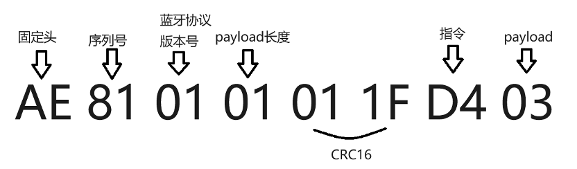


**所有文字传输都使用UTF-8编码**


**指令字节：**

- D1: 设置熄屏时间

- D2: 调节音量

- D3: 眼镜亮度

- D4: 设置语言

- D5: 消息通知

- D6: 导航（暂时不做）

- D7: 设置时间

- D9: 获取设备信息

- DD: 消息通知设置

- DE: 传感器数据获取

- DA: AI模式

- DB: 操控眼镜的状态

- DC: AI提问文字传输

- CD: AI回答文字传输

- DF: 修改设备蓝牙名字


**CRC16计算方式 //直接计算法计算 crc x16+x12+x5+1**

```cpp
uint16_t crc_IBM(uint8_t *ptr, int len)
{

    unsigned int i;

    unsigned short crc = 0x0000; //crc16位寄存器初始值

    while(len‐‐)
    {
        crc ^= *ptr++;

        for (i = 0; i < 8; ++i)
        {
            if (crc & 1)
                crc = (crc >> 1) ^ 0xA001;
            else
                crc = (crc >> 1);
        }
    }

    return crc;
}
```


Java 版本：

```java
public static int CRC16_IBM(byte[] buffer)
{

    int wCRCin = 0x0000;

    int wCPoly = 0xa001;

    int bitMax = 8;

    for (byte b : buffer) {

        wCRCin ^= ((int) b & 0x00ff);

        for (int j = 0; j < bitMax; j++) {

            if ((wCRCin & 0x0001) != 0) {

                wCRCin >>= 1;

                wCRCin ^= wCPoly;

            } else {

                wCRCin >>= 1;

            }

        }

    }

    return wCRCin ^= 0x0000;

}
```


**后续示例都是指令+payload**

**1.**     **设置熄屏时间 D1**

| 2 byte | 0x0001-0xffff | 单位：秒 |
| ------ | ------------- | ---- |

手机发送指令给眼镜端：

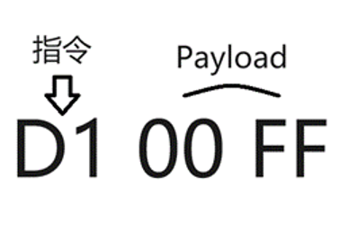

眼镜端回复手机端：（开发过程中错误原因进行收集并进行文档的补充）

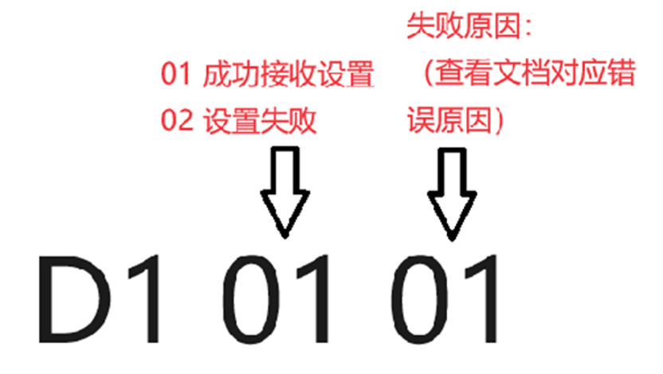

**2.**     **调节音量 D2**

| 1 byte | 0x00-0x0f | 0-15级 |
| ------ | --------- | ----- |

手机发送指令给眼镜端：


眼镜端回复手机端：（开发过程中错误原因进行收集并进行文档的补充）

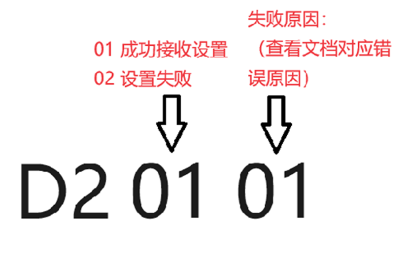

**3.**     **调节亮度 D3**

| 1 byte | 0x01-0x20 | 亮度等级 |
| ------ | --------- | ---- |

手机发送指令给眼镜端：

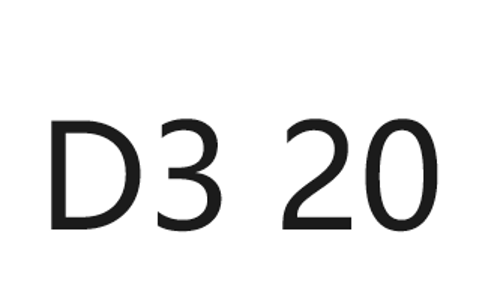

眼镜端回复手机端：（开发过程中错误原因进行收集并进行文档的补充）

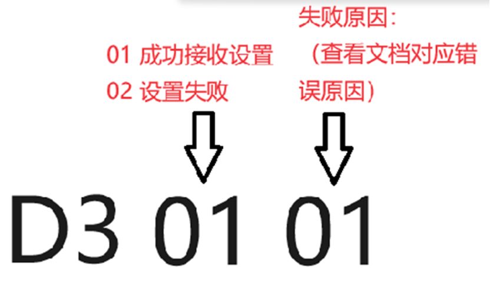

**4.**     **切换语言 D4**

| 1 byte | 0x01-0x07 | 0x01 英语 <br/>0x02 德语 <br/>0x03 日语 <br/>0x04 中文<br/> 0x05 法语 <br/>0x06 韩语 <br/>0x07 西班牙语 |
| ------ | --------- | --------------------------------------------------------------------------------------- |

手机发送指令给眼镜端：

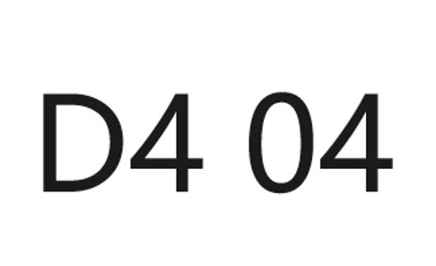

眼镜端回复手机端：（开发过程中错误原因进行收集并进行文档的补充）

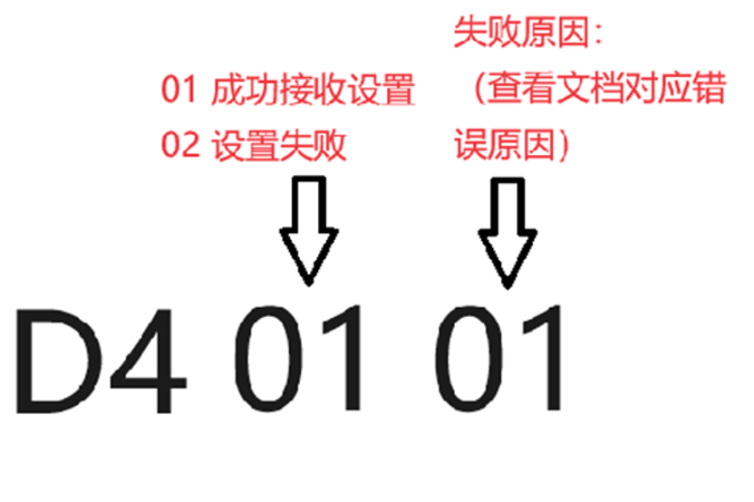

**5.**     **消息通知 D5**

数据是Key-Value以UTF-8来进行拆分并组装传送

**B:**

- 0 来电提醒

- 1 短信提醒

- 2 Skype提醒

- 3 Line提醒

- 4 kakaotalk提醒

- 5 facebook提醒

- 6 twitter（X）提醒

- 7 whatsapp提醒

- 8 linkedin提醒

- 9 viber提醒

- 10 instagram提醒

- 11 messenger提醒

- 12 微信提醒

- 13 QQ提醒

- 14 钉钉提醒

- 15 其他APP

**U:**

- 0 默认框

- 1 样式一  

- 2 样式二 

- 3 样式三 

Key-Value的具体格式为：

**t:标题; c:内容; b:属于哪个软件; m: 年月日时分秒（2404071630）代表24年 4月 7日 16点 30 分;u:0**

手机发送指令给眼镜端：

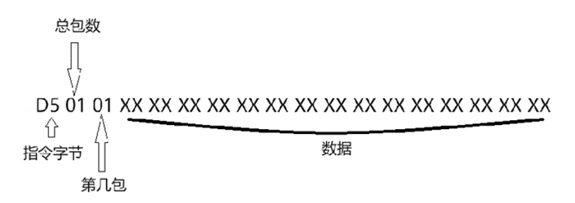

眼镜端回复手机端（包数据汇总的时候如果出现遗漏的或者存在校验和错误的数据包，需要重新请求对应的数据包）：

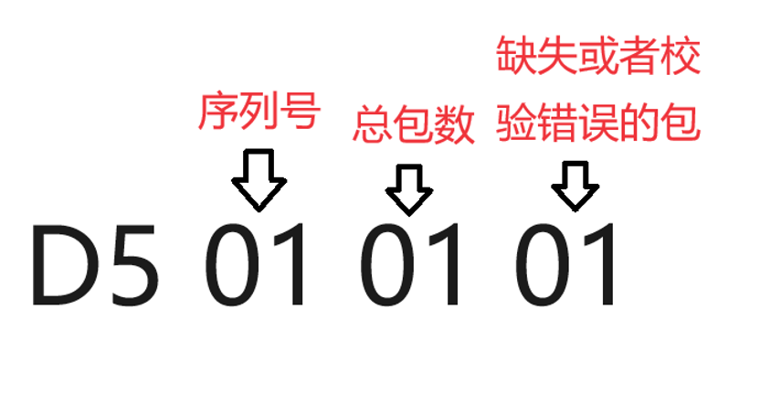

**6.**     **导航D6**

**图标导航方向：**

    **0x00                        0x01**

     **0x02                        0x03**

     **0x04                        0x05**

     **0x06                         0x07**

     **0x08                         0x09**

     **0x0A                         0x0B**

     **0x0C                         0x0D**

     **0x0E                         0x0F**

     **0x10                         0x11**

     **0x12                         0x13**

     **0x14                         0x15**

     **0x16                          0x17**

     **0x18                         0x19**

     **0x1A                         0x1B**

     **0x1C                         0x1D**

     **0x1E                            0x1F**

     **0x20                            0x21**

     **0x22                            0x23**

     **0x24                            0x25**

     **0x26                            0x27**

      **0x28                           0x29**

     **0x2A                            0x2B**

     **0x2C                            0x2D**

     **0x2E                            0x2F**

     **0x30                            0x31**

     **0x32                            0x33**

     **0x34                            0x35**

     **0x36                           0x37**

     **0x38                           0x39**

     **0x3A                           0x3B**

     **0x3C                           0x3D**

     **0x3E                           0x3F**

     **0x40                           0x41**

     **0x42                           0x43**

     **0x44                          0x45**

     **0x46                           0x47**

     **0x48                           0x49**

     **0x4A                           0x4B**

     **0x4C**

| 2 byte       | 对照UI设计稿里面的数值  | 图标导航方向                             |
| ------------ | ------------- | ---------------------------------- |
| 2 byte       |               | 总时间（分钟）                            |
| 4 byte       |               | 总路程（米）                             |
| 4 byte       |               | 剩余路程（米）                            |
| 1 byte       |               | 目前速度                               |
| 4 byte       |               | 当前路段剩余距离（米）                        |
| 45 byte      |               | 导航信息                               |
| 5 byte       | 1 byte 表示路况状态 | 0-未知，1-道路通畅，2-道路缓行，3-道路阻塞，4-道路严重阻塞 |
| 4 byte表示路况长度 | 交通状态路段的拥堵状态长度 |                                    |
| …            | 1 byte 表示路况状态 | 0-未知，1-道路通畅，2-道路缓行，3-道路阻塞，4-道路严重阻塞 |
| 4 byte表示路况长度 | 交通状态路段的拥堵状态长度 |                                    |

**7.**     **设置时间 D7**

| 1byte | 年   | 从2000年开始，比如数值为24，眼镜 端解析自动加上 2000，年为2024 |
| ----- | --- | --------------------------------------- |
| 1byte | 月   | 1-12                                    |
| 1byte | 日   | 1-31                                    |
| 1byte | 时   | 0-23                                    |
| 1byte | 分   | 0-59                                    |
| 1byte | 秒   | 0-59                                    |

手机发送给眼镜端：

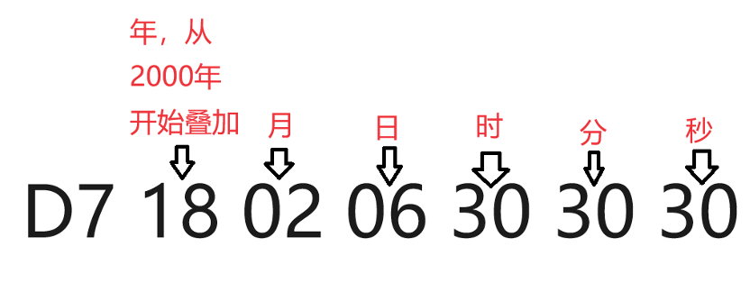

眼镜端回复给手机：

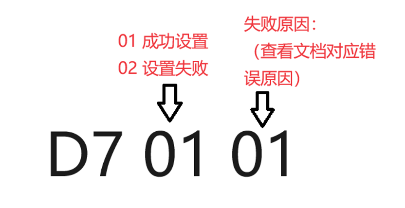

**8.**     **获取设备信息 D9**

| 8 byte | 项目固件名称：不足的补0  | 固件名  |
| ------ | ------------- | ---- |
| 1byte  | 固件平台1         | 固件平台 |
| 1byte  | 固件型号1         | 固件型号 |
| 3byte  | 版本号，例如 1.0.1  | 版本号  |
| 1byte  | 当前亮度0x01-0x20 |      |
| 1byte  | 当前语言0x01-0x07 |      |
| 1byte  | 当前音量0x00-0x0f |      |
| 1byte  | 是否开启了拾音       |      |
| 1byte  | 当前处于什么模式      |      |

**9.**     **消息通知 DD**

| 1<br> byte | 0   | **0x01 设置消息通知** **0x02 获取消息通知** **获取消息通知，等眼镜返回现在的消息通知设置开关信息。** |
| ---------- | --- | -------------------------------------------------------------- |
| 1 byte     | 1   | Skype提醒（00关闭，01打开）                                             |
| 1 byte     | 2   | Line提醒（00关闭，01打开）                                              |
| 1 byte     | 3   | 来电提醒（00关闭，01打开）                                                |
| 1 byte     | 4   | 短信提醒（00关闭，01打开）                                                |
| 1 byte     | 5   | 微信提醒（00关闭，01打开）                                                |
| 1 byte     | 6   | QQ提醒（00关闭，01打开）                                                |
| 1 byte     | 7   | kakaotalk提醒（00关闭，01 打开）                                        |
| 1 byte     | 8   | facebook（00关闭，01打开）                                            |
| 1 byte     | 9   | twitter（00关闭，01打开）                                             |
| 1 byte     | 10  | whatsapp（00关闭，01打开）                                            |
| 1 byte     | 11  | linkedin（00关闭，01打开）                                            |
| 1 byte     | 12  | Viber（00关闭，01打开）                                               |
| 1 byte     | 13  | Instagram（00关闭，01打开）                                           |
| 1 byte     | 14  | messenger（00关闭，01打开）                                           |
| 1 byte     | 15  | 其他app（00关闭，01打开）                                               |
| 1 byte     | 16  | 钉钉（00关闭，01打开）                                                  |

**10.**  **传感器数据获取 DE**

| 2 byte | 水平角度 0-360度 | 0x00-0x168 |
| ------ | ----------- | ---------- |
| 2 byte | 垂直角度 +-180度 | 0x00-0x168 |
| 2 byte | 左右倾角 +-90度  | 0x00-0x168 |

**11.**  **AI模式 DA**

模式定义清单：

**0x01 Reading and Writing Mode 读写模式**

**0x02 Driving Mode 驾驶模式**

**0x03 Gaming Mode 游戏模式**

**0x04 Translation Mode 翻译模式**

**0x05 Cooking Mode 烹饪模式**

**0x06 Morse Code Mode 摩斯码模式**

**0x07 Team Mode 团队模式**

**0x08 Yoga Mode 瑜伽模式**

**0x09 ChatGPT Mode ChatGPT模式**

**0x0A Phone Mode 手机模式**

眼镜发送给手机端：

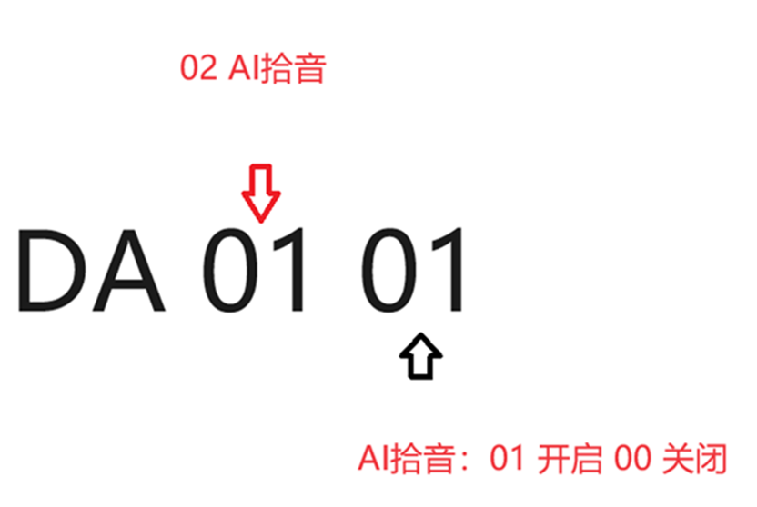

手机端回复眼镜端：

耳机1：因为现在外设只有耳机，以后如果有新增外设可以再继续定义

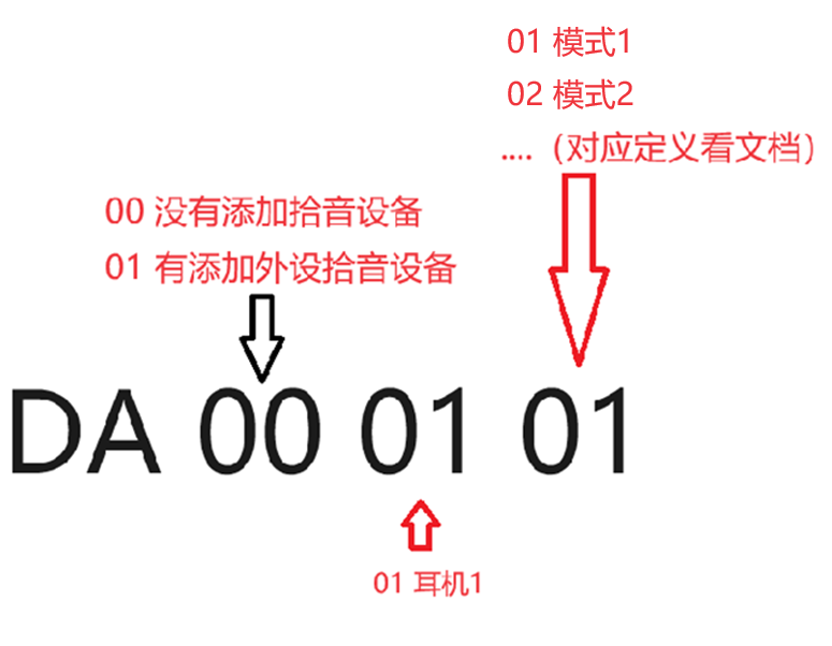

眼镜端回复手机端：（开发过程中错误原因进行收集并进行文档的补充）

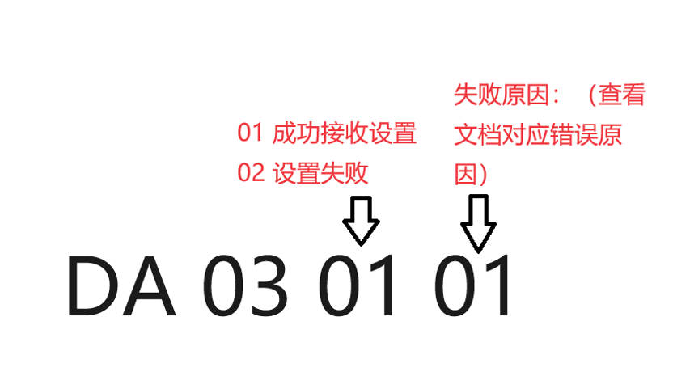

**12.**  **操控眼镜的状态 DB**

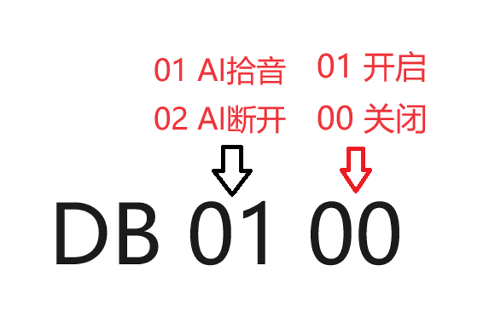

**02： AI断开，如果在AI对话中，APP与远程的AI服务断开连接，会发送DB 02 00来提醒眼镜弹出提示让用户进行检查。**

**03：控制当前AI对话框只显示单独一个回复框，不需要显示提问框 DB 03 00 关闭提问框。DB 03 01 打开提问框（默认都是打开，从AI模式退出后再进入AI模式，默认所有框都不隐藏）04: 开启或关闭导航功能**

**13.**  **AI问题文字传输  DC**

手机端回复文字给眼镜端：

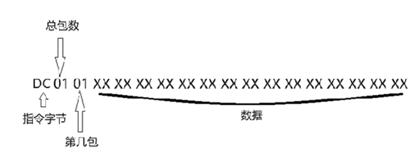

问题的文字信息（UTF-8传输）

眼镜端回复手机端（包数据汇总的时候如果出现遗漏的或者存在校验和错误的数据包，需要重新请求对应的数据包）：

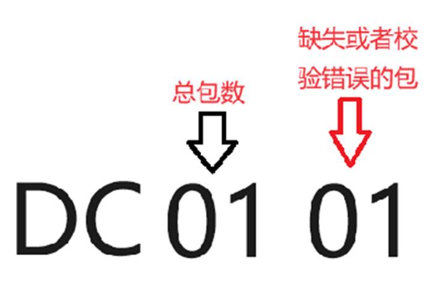

**14.**  **AI回答文字传输 CD**

手机端回复文字给眼镜端：

回复的文字信息（UTF-8传输）

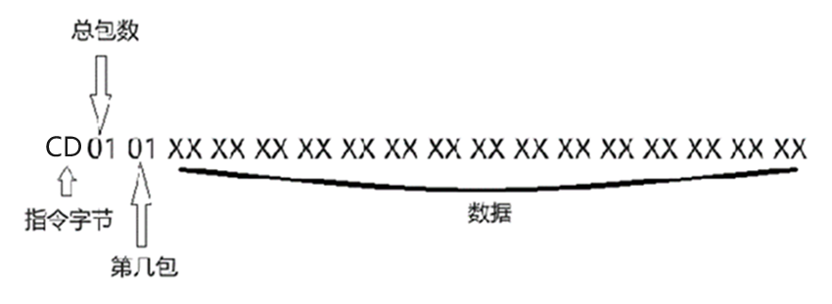

眼镜端回复手机端（包数据汇总的时候如果出现遗漏的或者存在校验和错误的数据包，需要重新请求对应的数据包）：


**15.**  **修改设备蓝牙名字 DF**

名字限制最大字节长度为**168**个字节。字节是**utf-8**存储传递。

手机端发送眼镜端：

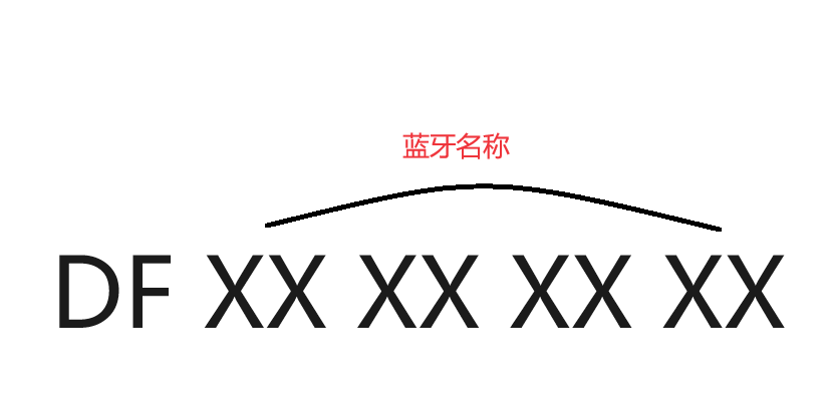

眼镜端回复手机端：

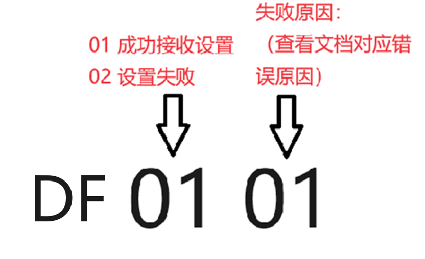
